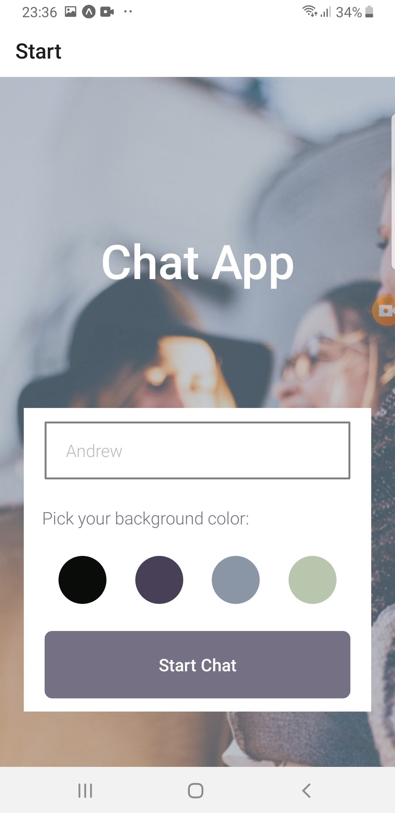
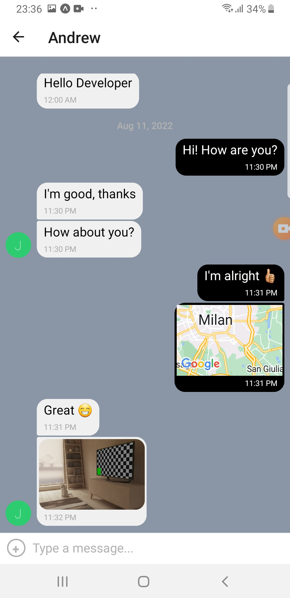

# meet app

## Project description

This is a chat application built for mobile devices (both for iOS and Android) using React Native. The app provides users with a chat interface and options to share pictures and their location.

## Technologies used 

- React Native
- Expo
- Google Firebase
- Google Firestore Database
- [GiftedChat](https://github.com/FaridSafi/react-native-gifted-chat)
- [React Native Async Storage](https://github.com/react-native-async-storage/async-storage)
- [NetInfo](https://github.com/react-native-netinfo/react-native-netinfo)
- [react-native-action-sheet](https://github.com/expo/react-native-action-sheet)
- expo-image-picker
- expo-camera
- expo-location
- react-native-maps

### User Stories

- As a new user, I want to be able to easily enter a chat room so I can quickly start talking to my friends and family.
- As a user, I want to be able to send messages to my friends and family members to exchange the latest news.
- As a user, I want to send images to my friends to show them what I’m currently doing.
- As a user, I want to share my location with my friends to show them where I am.
- As a user, I want to be able to read my messages offline so I can reread conversations at any time.
- As a user with a visual impairment, I want to use a chat app that is compatible with a screen reader so that I can engage with a chat interface.

<p float="left">
  
  
  
  
</p>

### Key Features

- The homepage gives users the option to enter their name and the background color of the chat screen.
- The chat screen diplays messages sent by all users of the app.
- Users can also chose to send pictures and their current location from the chat screen 
- If offline, users can view all messages available up until they had a connection 

## Getting Started

### Prerequisites

- Install npm with the latest required dependecies using the following command:

```bash
npm install npm@latest -g
```

### To run the project:

1. Install the Expo CLI as a global package

```bash
npm install --global expo-cli
```

2. To run the app on your mobile phone, install the Expo app (on the App store or Google Play). Alternatively, you can run the project on your personal computer by installing Android Studio for Windows and Linux or Simulator for Xcode.

3. Clone repository:

```bash
git clone https://github.com/amro-mansour/chat-app.git
```

4. Install all dependecies:

```bash
npm install
```

5. Start the project with:

```bash
expo start
```

6. Launch the app on your mobile phone (using the Expo app) or using the simulator.

### Implement your own database on Google Firebase/Firestore

In order to use the chat app, you have to create your own Google Firebase/Firestore account for data storage. Set up your Firebase database following these steps:

1. Go to [Google Firebase](https://firebase.google.com/) and login with your Google account or create a new account.
2. Go to the <strong>Firebase console</strong> and create a new project.
3. Click on <strong>Develop</strong> on the menu and select <strong>Cloud Firestore</strong> and then <strong>Create Database</strong>
4. Follow the instructions to create a new database. (You can choose to <strong>start in test mode</strong>.)
5. Create a new collection called "messages".
6. Got to <strong>Project settings</strong>, you’ll find a section called <strong>Your apps</strong>. Click the <strong>Firestore for Web</strong> button (it may be shown as the </> icon).
7. A new screen opens asking you to register your web application to connect to the Cloud Firestore database you just created. Enter a name for your chat application and then click <strong>Register</strong> to generate the configuration code. Copy the contents of the firebaseConfig object and paste this configuration info into the firebaseConfig in Chat.js.

